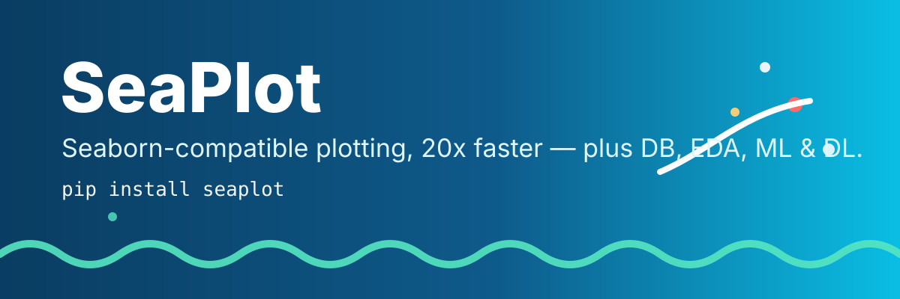
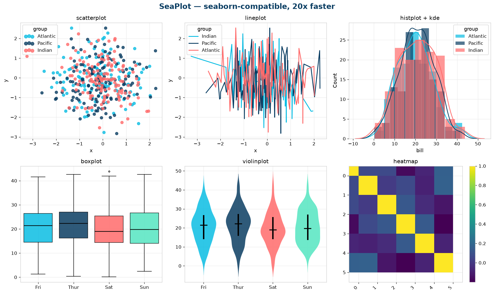

<p align="center">
  
</p>
<h1 align="center">SeaPlot</h1>
<p align="center"><strong>Seaborn-compatible statistical plotting — 20x faster — plus a full data toolkit for analysts, data scientists, and ML/DL engineers.</strong></p>

<p align="center">
  <a href="https://github.com/salim-studio/seaplot/actions"></a>
  
  
  
  
</p>

<p align="center">
  
</p>
<p align="center">
  
</p>

`import seaplot as sp` is a drop-in replacement for `import seaborn as sns` — every hot path re-engineered: NumPy-vectorized aggregation, Numba KDE kernels, single-Collection draws, and automatic decimation for big data. On top of plotting, SeaPlot ships a pragmatic toolkit: universal IO, one-line databases, wrangling, stats, one-line EDA, sklearn-powered ML, and a dependency-free neural net.

```python
import seaplot as sp  # drop-in for: import seaborn as sns
sp.set_theme(style="whitegrid", palette="seaplot")

sp.scatterplot(data=df, x="total_bill", y="tip", hue="day")
sp.histplot(data=df, x="total_bill", hue="sex", kde=True)
sp.boxplot(data=df, x="day", y="total_bill")
sp.heatmap(df.corr(numeric_only=True), annot=True)
sp.pairplot(df, hue="species")
```

```python
# Beyond plotting: IO + DB + EDA + ML + DL
df = sp.read("data.csv")                       # csv / parquet / json / excel / sql
db = sp.connect("sqlite:///shop.db")           # sqlite / duckdb / sqlalchemy
db.write_df(df, "sales", if_exists="replace")
top = db.query("SELECT day, AVG(total_bill) AS m FROM sales GROUP BY day")

df = sp.clean(df)                              # dedupe + dtypes + missing in one line
report = sp.profile(df)                        # dict report + overview figure
sp.plot_missing(df); sp.plot_corr(df)

sp.describe(df); sp.ttest(df, "tip", group="sex")

model, summary = sp.train(df, target="survived")   # auto classifier
mlp = sp.MLP(hidden=(64, 32), epochs=50)           # pure-NumPy, no torch required
mlp.fit(X_train, y_train)
```

## Why SeaPlot?

| Hot path | seaborn | SeaPlot |
|---|---|---|
| Group aggregation | `pandas.groupby` loops | `np.bincount` vectorized (~22x on 200k rows) |
| KDE | SciPy pairwise O(n·m) in Python | Numba `@njit` Gaussian kernel + 20k subsample cap |
| Scatter 200k+ pts | one marker per call, slow legend | stratified decimation + auto `rasterized=True` |
| Lineplot | sort + groupby-apply + bootstrap loops | `argsort` + bincount + min-max decimation (50k cap) |
| Heatmap annot | `Text` per cell, always | skipped with warning above 2000 cells |
| Palettes | rebuilt every call | `lru_cache` + signature `seaplot` palette |
| Boxplot | one artist per box | single `ax.bxp()` call |

Optional `pip install "seaplot[speed]"` adds Numba for another 3–10x on KDE/bootstrap.

## Install

```bash
pip install seaplot                 # plotting + stats + sklearn ML
pip install "seaplot[speed]"        # + numba acceleration
pip install "seaplot[db]"           # + sqlalchemy + duckdb
pip install "seaplot[dl]"           # + torch (optional)
pip install "seaplot[all]"          # everything
pip install -e .                    # local dev checkout
```

Requires Python ≥ 3.9. Plotting needs `numpy`, `matplotlib`, `pandas`, `scipy`; ML needs `scikit-learn` (installed by default).

## API coverage

Seaborn-compatible plotting:

- Relational: `scatterplot`, `lineplot`, `relplot`
- Distributions: `histplot`, `kdeplot`, `ecdfplot`, `rugplot`, `displot`
- Categorical: `barplot`, `countplot`, `boxplot`, `violinplot`, `stripplot`, `swarmplot`, `pointplot`, `boxenplot`, `catplot`
- Regression: `regplot`, `lmplot`, `residplot`
- Matrix: `heatmap`, `clustermap`
- Grids: `FacetGrid`, `PairGrid`, `JointGrid`, `pairplot`, `jointplot`
- Style: `set_theme`, `set_style`, `set_context`, `axes_style`, `plotting_context`, `despine`, `reset_defaults`
- Palettes: `color_palette` (default `seaplot`), `hls_palette`, `husl_palette`, `dark_palette`, `light_palette`, `diverging_palette`, `cubehelix_palette`, `set_palette`
- Data: `load_dataset`, `get_dataset_names`, `move_legend`

Data toolkit:

- IO: `read` / `smart_read`, `write` / `smart_write`, `read_sql`
- DB: `connect`, `query`, `OceanDB` (sqlite / duckdb / sqlalchemy)
- Wrangle: `clean`, `fill_missing`, `coerce_dtypes`, `encode`, `scale`, `train_test_split`, `missing_table`, `add_date_features`
- Stats: `describe`, `corr`, `ttest`, `chi2_test`, `anova`, `outliers`, `normality`
- EDA: `profile`, `plot_missing`, `plot_corr`, `plot_dist_grid`
- ML: `make_pipeline`, `train`, `evaluate`, `cross_validate`, `clusters`, `feature_importance`, `save_model`, `load_model`
- DL: `MLP`, `torch_mlp`
- Utils: `seed_everything`, `Timer`, `memory_usage`, `numeric_columns`, `categorical_columns`

All plot functions accept `pandas` / `polars` / `dict` / `numpy` inputs with the same `data, x, y, hue` convention as seaborn.

## Migrating

| From | To |
|---|---|
| `import seaborn as sns` | `import seaplot as sp` |
| `import oceanborn as ob` | `import seaplot as sp` (renamed project) |
| `sns.set_theme(...)` | `sp.set_theme(style="whitegrid", palette="seaplot")` |

`oceanborn` is the former name of this project; `seaplot` is the new canonical name and PyPI distribution. There is no `oceanborn` shim — rename the import.

## Benchmark

```bash
python benchmarks/bench.py
# groupby-mean n=200000 k=50: pandas 94.7ms  seaplot 4.2ms  speedup x22.4
```

## Examples

- `examples/quickstart.py` — classic seaborn-style gallery
- `examples/fullstack.py` — DB → wrangle → EDA → viz → ML → DL end to end

```bash
python examples/quickstart.py
python examples/fullstack.py
```

## Brand

Signature palette `seaplot` (`#0ABDE3, #0A3D62, #FF6B6B, #55E6C1, ...`), logo in `assets/logo.svg`, banner in `assets/banner.svg`. See `docs/BRAND.md` for usage, colors, and voice. Please keep the wave mark unmodified when featuring SeaPlot.

## Contributing

See `CONTRIBUTING.md`. PRs welcome: `python -m pytest tests -q` must stay green.

## License

MIT — see `LICENSE`.
